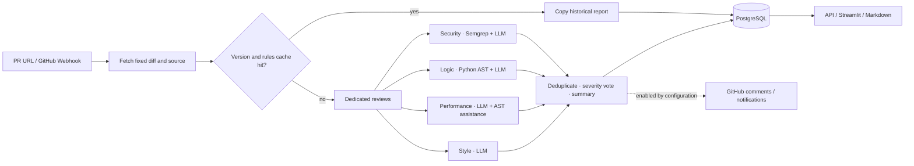

<p align="center">
  
</p>

<h1 align="center">CodeReview-Agent</h1>

<p align="center">
  <a href="README.md">中文</a> | <strong>English</strong>
</p>

<p align="center">
  <strong>Give every Pull Request four review perspectives.</strong><br />
  A GitHub PR review workbench powered by static analysis and large language models.
</p>

<p align="center">
  <a href="https://github.com/lonelydoll42/CodeReview-Agent/actions/workflows/ci.yml"></a>
  
  
  
</p>

<p align="center">
  <a href="#quick-start">Quick start</a> ·
  <a href="docs/example-report.md">Example report (Chinese)</a> ·
  <a href="docs/guide.md">User guide (Chinese)</a> ·
  <a href="docs/recruiter_brief.md">Project highlights (Chinese)</a> ·
  <a href="CONTRIBUTING.md">Contributing (Chinese)</a>
</p>

---

## From a PR link to an actionable review report

Provide a GitHub Pull Request URL. The system retrieves the code changes and a fixed source snapshot, sends them to four dedicated agents - **Security, Logic, Performance, and Style** - then deduplicates and arbitrates their findings into a Markdown report.

Each finding includes its file, line number, severity, suggested fix, confidence, and source agent. The web workbench lets you browse history, filter findings, and download reports. You can also publish results back to the GitHub PR when needed.

| Capability | What it does |
| --- | --- |
| **Four dedicated perspectives** | Reviews security vulnerabilities, logic defects, performance issues, and code style separately |
| **Tool-assisted analysis** | Uses Semgrep for security signals and Python AST plus radon for structure and complexity information |
| **Traceable code snapshots** | Records base/head/merge-base SHAs and uses a fixed source version; refuses to continue if the PR changes during retrieval |
| **Unified reports** | Merges related findings, votes on severity using agent weights and confidence, and preserves finding sources |
| **Review workbench** | Provides Tasks, Review, and Dashboard pages for task history, report browsing, and trend statistics |
| **Optional automation** | Supports GitHub Webhook triggers, PR and inline comments, and Slack / WeCom notifications |

> This is a runnable engineering project for local experiments, learning about agent applications, and further development. See [Current boundaries](#current-boundaries) for scope and deployment considerations. The cover is a process illustration, not a product screenshot.

## Review pipeline



The cache considers the PR URL, comparison versions, merge base, and analysis code fingerprint. A result is cached only after persistence succeeds and all agent calls return; a cache hit copies the report into a new queryable task. Redis also stores task status and agent result caches.

## How the four agents divide the work

| Agent | Problems it focuses on | Analysis method |
| --- | --- | --- |
| **Security** | SQL injection, XSS, hardcoded credentials, path traversal, and more | Semgrep rules + Claude semantic analysis |
| **Logic** | Boundary conditions, null handling, exception handling, complex logic, and more | Python AST / radon + Claude |
| **Performance** | Repeated work in loops, unnecessary copies, blocking calls, and more | Claude + Python structural information |
| **Style** | Naming, function length, docstrings, magic numbers, and more | Claude tool-use review in added-line chunks |

The review can identify and process Python, JavaScript, TypeScript, Go, Java, Ruby, Rust, C, C++, C#, PHP, Swift, Kotlin, Scala, Bash, and SQL. **Language identification does not imply equal static-rule coverage**: AST analysis is mainly aimed at Python, while Semgrep checks depend on the built-in rules.

<a id="quick-start"></a>
## Quick start

Prepare Python **3.10 / 3.11**, Docker, and an Anthropic API key that can call the Claude model configured for the project. The GitHub token is used to access repositories and, when enabled, write comments back.

### 1. Get the project and install dependencies

```bash
git clone https://github.com/lonelydoll42/CodeReview-Agent.git
cd CodeReview-Agent
python3 -m venv .venv
source .venv/bin/activate
python -m pip install -r requirements.txt
cp .env.example .env
```

Edit `.env` and fill in `ANTHROPIC_API_KEY` and `GITHUB_TOKEN`. Default model constants are defined in the agent and aggregator modules; the current main flow uses the Anthropic SDK.

### 2. Start the local database and cache

```bash
docker run -d --name codereview-postgres \
  -p 127.0.0.1:5432:5432 \
  -e POSTGRES_PASSWORD=postgres \
  -e POSTGRES_DB=codereview \
  postgres:15

docker run -d --name codereview-redis \
  -p 127.0.0.1:6379:6379 \
  redis:7
```

These commands match the local connection settings in `.env.example`. If the containers already exist, run `docker start codereview-postgres codereview-redis` to start them again.

### 3. Start the API

```bash
python -m uvicorn api.main:app --host 127.0.0.1 --port 8000
```

Open another terminal and start the UI from the project root:

```bash
source .venv/bin/activate
export DASHBOARD_USER=reviewer
read -rsp 'Set the workbench password: ' DASHBOARD_PASSWORD; echo
export DASHBOARD_PASSWORD
export SECRET_KEY="$(python -c 'import secrets; print(secrets.token_hex(32))')"
python -m streamlit run ui/app.py --server.address 127.0.0.1
```

Open the [workbench](http://localhost:8501) and sign in with the account and password you just set. Interactive API documentation is available in [Swagger UI](http://localhost:8000/docs). UI environment variables are read from the process environment; see the [user guide (Chinese)](docs/guide.md) for the full explanation.

### 4. Run your first review

Paste a real PR link into the **Tasks** page and click **Queue Review**, or use the API:

```bash
curl -X POST http://localhost:8000/review \
  -H 'Content-Type: application/json' \
  -d '{"pr_url":"https://github.com/OWNER/REPO/pull/NUMBER"}'

# Replace 1 with the task_id returned when the task is created
curl http://localhost:8000/review/1
```

GitHub comments and notifications are disabled by default. See [integration settings (Chinese)](docs/guide.md#github-与通知集成) to enable them.

## What a report looks like

The following is demonstration data, **not a conclusion about real vulnerabilities in this repository**. See the [example report (Chinese)](docs/example-report.md) for the complete summary, statistics, and recommendations.

| File and line | Severity | Finding category | Suggested fix | Source |
| --- | --- | --- | --- | --- |
| `src/users.py:24` | HIGH | `sql_injection` | Bind user input with a parameterized query | SecurityAgent |
| `src/batch.py:48` | MEDIUM | `loop_invariant` | Move invariant computation outside the loop | PerformanceAgent |
| `src/config.py:12` | LOW | `magic_number` | Extract the retry count into a named constant | StyleAgent |

## Documentation map

| What you want to learn | Start here |
| --- | --- |
| Configuration, API, Webhook, workbench usage, and troubleshooting | [User guide (Chinese)](docs/guide.md) |
| What a review result contains | [Example report (Chinese)](docs/example-report.md) |
| Design decisions and interview presentation ideas | [Project highlights (Chinese)](docs/recruiter_brief.md) |
| Local tests, branches, and contribution workflow | [CONTRIBUTING.md (Chinese)](CONTRIBUTING.md) |
| Fixed snapshots, source coordinates, caching, and persistence improvements | [Integration notes (Chinese)](docs/git-optimization.md) |
| Cover source file and reuse instructions | [Visual assets (Chinese)](docs/assets/README.md) |

<details>
<summary><strong>View the project structure</strong></summary>

```text
agents/          Four dedicated agents, shared models, aggregator, and orchestrator
api/             FastAPI tasks, Webhook, and statistics endpoints
tools/           GitHub snapshots, AST, Semgrep, and versioned cache tools
storage/         PostgreSQL models and Redis cache
notifications/   Slack / WeCom notifications
ui/              Streamlit review workbench
eval/            Precision / Recall / F1 evaluation tools
graph/           Backup LangGraph workflow
tests/           Unit tests and PostgreSQL integration tests
docs/            User guide, examples, and homepage assets
```

</details>

## Development and verification

```bash
python -m pip install -r requirements-dev.txt
python -m pytest -q
ruff check .
python -m pip check
```

Regular tests mock GitHub, model, and external services, so no API key is needed. Set `TEST_DATABASE_URL` to run the real PostgreSQL integration tests as well; CI covers Python 3.10 / 3.11 and PostgreSQL 15. See the [contribution guide (Chinese)](CONTRIBUTING.md) for the test strategy and isolated schema cleanup.

<a id="current-boundaries"></a>
## Current boundaries

- Supports UTF-8 text up to 1 MiB; deleted files, binaries, and unsupported languages are reported as not analyzed.
- Uses in-process background tasks and does not include a recoverable distributed queue. Some agent calls remain synchronous, and concurrency control and timeout guarantees need further work.
- Some failure paths may still appear as empty results; finding no issues does not prove that code is secure and should be paired with human review.
- Workbench login and API access control are separate; the API has no unified authentication layer, so public deployments need additional access control.
- There is currently no RiskProfile, Playbook routing, automatic Merge Gate, or general model Provider API; `graph/` is a backup orchestration path rather than the default API entry point.

## Future directions

- [ ] Explicitly distinguish complete, partially failed, and uncovered review results.
- [ ] Improve asynchronous model calls, concurrency limits, and recoverable task queues.
- [ ] Add unified API authentication and deployment configuration.
- [ ] Expand the evaluation dataset and keep tracking false positives, false negatives, and cost.
- [ ] Explore more models and code hosting platforms on top of the existing agent interfaces.

Please use [Issues](https://github.com/lonelydoll42/CodeReview-Agent/issues) to report problems, or follow the [contribution guide (Chinese)](CONTRIBUTING.md) to propose an improvement.
