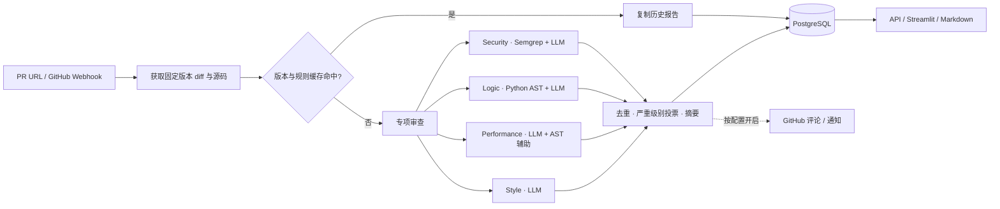

<p align="center">
  
</p>

<h1 align="center">CodeReview-Agent</h1>

<p align="center">
  <strong>让每一次 Pull Request，都多四个审查视角。</strong><br />
  基于静态分析与大语言模型的 GitHub PR 审查工作台。
</p>

<p align="center">
  <a href="https://github.com/lonelydoll42/CodeReview-Agent/actions/workflows/ci.yml"></a>
  
  
  
</p>

<p align="center">
  <a href="#快速开始">快速开始</a> ·
  <a href="docs/example-report.md">报告示例</a> ·
  <a href="docs/guide.md">使用指南</a> ·
  <a href="docs/recruiter_brief.md">项目亮点</a> ·
  <a href="CONTRIBUTING.md">参与开发</a>
</p>

---

## 从一条 PR 链接，到一份可执行的审查报告

输入 GitHub Pull Request URL，系统获取代码变更与固定版本的源码，由 **Security、Logic、Performance、Style** 四个 Agent 分别审查，再将结果去重、仲裁并整理成 Markdown 报告。

每条问题包含文件、行号、严重级别、修改建议、置信度与来源 Agent。可以在 Web 工作台查看历史、筛选问题和下载报告，也可以按需将结果发布到 GitHub PR。

| 能力 | 具体做什么 |
| --- | --- |
| **四个专项视角** | 安全漏洞、逻辑缺陷、性能问题、代码风格分别审查 |
| **工具辅助判断** | Semgrep 提供安全规则信号，Python AST 与 radon 提供结构和复杂度信息 |
| **可追溯的代码快照** | 记录 base/head/merge-base SHA，使用固定版本源码；PR 在获取期间变化时拒绝继续 |
| **统一报告** | 合并相近问题，按 Agent 权重与置信度投票决定严重级别，保留问题来源 |
| **审查工作台** | Tasks、Review、Dashboard 三个页面，支持任务历史、报告浏览和趋势统计 |
| **可选自动化** | GitHub Webhook 触发、PR 评论与行内评论、Slack / 企业微信通知 |

> 当前是可运行的工程项目，适合本地体验、Agent 应用学习与二次开发。能力范围与部署注意事项见[当前边界](#当前边界)，封面是流程插画，不是产品运行截图。

## 审查链路



缓存同时考虑 PR URL、比较版本、共同祖先与分析代码指纹。结果持久化成功且全部 Agent 调用返回后才写入缓存；命中时为新任务复制可查询的报告。Redis 同时用于任务状态和 Agent 结果缓存。

## 四个 Agent 如何分工

| Agent | 关注的问题 | 分析方式 |
| --- | --- | --- |
| **Security** | SQL 注入、XSS、硬编码凭据、路径穿越等 | Semgrep 规则 + Claude 语义分析 |
| **Logic** | 边界条件、空值处理、异常处理、复杂逻辑等 | Python AST / radon + Claude |
| **Performance** | 循环内重复工作、不必要复制、阻塞调用等 | Claude + Python 结构信息 |
| **Style** | 命名、函数长度、文档字符串、魔法数字等 | 按新增行分块进行 Claude tool-use 审查 |

可识别并送入审查的语言包括 Python、JavaScript、TypeScript、Go、Java、Ruby、Rust、C、C++、C#、PHP、Swift、Kotlin、Scala、Bash、SQL。**语言识别范围不代表静态规则覆盖相同**：AST 分析主要面向 Python，Semgrep 检查取决于内置规则。

<a id="快速开始"></a>
## 快速开始

准备 Python **3.10 / 3.11**、Docker，以及可调用项目所配置 Claude 模型的 Anthropic API Key。GitHub Token 用于访问仓库与按需回写评论。

### 1. 获取项目并安装依赖

```bash
git clone --branch integration/review-updates https://github.com/lonelydoll42/CodeReview-Agent.git
cd CodeReview-Agent
python3 -m venv .venv
source .venv/bin/activate
python -m pip install -r requirements.txt
cp .env.example .env
```

编辑 `.env`，填写 `ANTHROPIC_API_KEY` 和 `GITHUB_TOKEN`。默认模型常量位于各 Agent 与 Aggregator 模块中；当前主流程使用 Anthropic SDK。

### 2. 启动本地数据库与缓存

```bash
docker run -d --name codereview-postgres \
  -p 127.0.0.1:5432:5432 \
  -e POSTGRES_PASSWORD=postgres \
  -e POSTGRES_DB=codereview \
  postgres:15

docker run -d --name codereview-redis \
  -p 127.0.0.1:6379:6379 \
  redis:7
```

这些命令与 `.env.example` 的本地连接配置对应。如果容器已存在，可用 `docker start codereview-postgres codereview-redis` 再次启动。

### 3. 启动 API

```bash
python -m uvicorn api.main:app --host 127.0.0.1 --port 8000
```

另开一个终端，在项目根目录启动 UI：

```bash
source .venv/bin/activate
export DASHBOARD_USER=reviewer
read -rsp '设置工作台登录密码: ' DASHBOARD_PASSWORD; echo
export DASHBOARD_PASSWORD
export SECRET_KEY="$(python -c 'import secrets; print(secrets.token_hex(32))')"
python -m streamlit run ui/app.py --server.address 127.0.0.1
```

访问[工作台](http://localhost:8501)，使用刚设置的账号密码登录；API 交互文档位于 [Swagger UI](http://localhost:8000/docs)。UI 环境变量由进程环境读取，完整说明见[使用指南](docs/guide.md)。

### 4. 发起第一次审查

在工作台的 **Tasks** 页面粘贴真实 PR 链接并点击 **Queue Review**，或使用 API：

```bash
curl -X POST http://localhost:8000/review \
  -H 'Content-Type: application/json' \
  -d '{"pr_url":"https://github.com/OWNER/REPO/pull/NUMBER"}'

# 用创建任务时返回的 task_id 替换 1
curl http://localhost:8000/review/1
```

默认关闭 GitHub 评论与通知。开启方式见[集成配置](docs/guide.md#github-与通知集成)。

## 报告长什么样

以下是演示数据，**并非对本仓库的真实漏洞结论**。完整的摘要、统计和建议见[报告示例](docs/example-report.md)。

| 文件与行号 | 严重级别 | 问题类别 | 建议 | 来源 |
| --- | --- | --- | --- | --- |
| `src/users.py:24` | HIGH | `sql_injection` | 使用参数化查询绑定用户输入 | SecurityAgent |
| `src/batch.py:48` | MEDIUM | `loop_invariant` | 将不变计算移到循环外 | PerformanceAgent |
| `src/config.py:12` | LOW | `magic_number` | 将重试次数提取为命名常量 | StyleAgent |

## 文档导航

| 想了解什么 | 从这里开始 |
| --- | --- |
| 配置、API、Webhook、工作台使用与故障排查 | [使用指南](docs/guide.md) |
| 一份审查结果包含哪些内容 | [报告示例](docs/example-report.md) |
| 设计取舍与面试展示思路 | [项目亮点](docs/recruiter_brief.md) |
| 本地测试、分支与贡献流程 | [CONTRIBUTING.md](CONTRIBUTING.md) |
| 固定快照、源码坐标、缓存与持久化改进 | [集成记录](docs/git-optimization.md) |
| 封面源文件与复用方式 | [视觉素材](docs/assets/README.md) |

<details>
<summary><strong>查看项目结构</strong></summary>

```text
agents/          四个专项 Agent、共享模型、聚合器与调度器
api/             FastAPI 任务、Webhook 和统计接口
tools/           GitHub 快照、AST、Semgrep 与缓存版本工具
storage/         PostgreSQL 模型与 Redis 缓存
notifications/   Slack / 企业微信通知
ui/              Streamlit 审查工作台
eval/            Precision / Recall / F1 评测工具
graph/           备用 LangGraph 工作流
tests/           单元测试与 PostgreSQL 集成测试
docs/            使用指南、示例与首页素材
```

</details>

## 开发与验证

```bash
python -m pip install -r requirements-dev.txt
python -m pytest -q
ruff check .
python -m pip check
```

普通测试 mock GitHub、模型和外部服务，无需 API Key。配置 `TEST_DATABASE_URL` 后会额外执行真实 PostgreSQL 集成测试；CI 覆盖 Python 3.10 / 3.11 和 PostgreSQL 15。测试策略与独立 schema 清理方式见[贡献指南](CONTRIBUTING.md)。

<a id="当前边界"></a>
## 当前边界

- 支持不超过 1 MiB 的 UTF-8 文本；删除文件、二进制及不支持的语言会在报告中注明未分析。
- 目前使用进程内后台任务，不包含可恢复的分布式队列。Agent 内仍有同步调用，并发控制与超时保证有待完善。
- 部分失败路径仍可能表现为空结果；没有发现问题不等于证明代码安全，需要结合人工审查。
- 工作台登录与 API 访问控制是两回事；API 暂无统一认证层，公开部署需要补充访问控制。
- 当前没有 RiskProfile、Playbook 路由、自动 Merge Gate 或通用模型 Provider API；`graph/` 是备用编排，不是 API 默认执行入口。

## 后续方向

- [ ] 显式区分完整、部分失败与未覆盖的审查结果。
- [ ] 完善异步模型调用、并发上限和可恢复任务队列。
- [ ] 增加统一 API 认证和部署配置。
- [ ] 扩展评测数据集，持续观察误报、漏报与成本。
- [ ] 在已有 Agent 接口基础上探索更多模型与代码托管平台。

欢迎通过 [Issues](https://github.com/lonelydoll42/CodeReview-Agent/issues) 提交问题，或参考[贡献指南](CONTRIBUTING.md) 发起改进。
