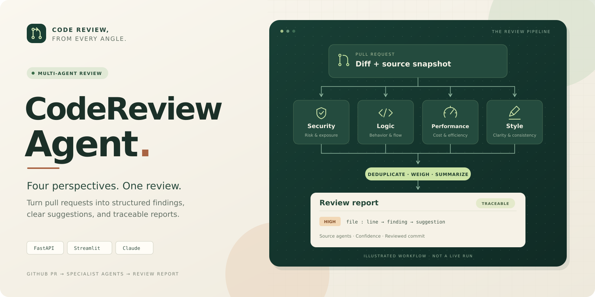

<p align="center">
  
</p>

<h1 align="center">CodeReview-Agent</h1>

<p align="center">
  <strong>一次请求，完成有证据的本地代码审查。</strong><br />
  一个可独立打包的 Skill 作为默认入口；服务端保留为可选自动化部署。
</p>

<p align="center">
  <a href="https://github.com/lonelydoll42/CodeReview-Agent/actions/workflows/ci.yml"></a>
  
  
  
</p>

<p align="center">
  <a href="#quickstart">Skill quickstart</a> ·
  <a href="docs/example-report.md">报告示例</a> ·
  <a href="docs/guide.md">Server guide</a> ·
  <a href="docs/recruiter_brief.md">项目亮点</a> ·
  <a href="CONTRIBUTING.md">参与开发</a>
</p>

---

## Review local changes in your coding assistant

`review-changes` drives one complete local review: select the worktree, index, or a branch comparison; capture a fixed snapshot; inspect relevant callers and tests; run optional static checks; verify candidate defects; and render a validated report. Semantic analysis uses the host assistant's current model, so this path needs no separate model key or running service.

The Skill package includes its scripts, review methods, and a standalone copy of the shared standard-library review core. It can run from a different project directory without cloning this service repository. Current supported inputs are local worktree, staged index, and local branch ranges. Remote PR review, recheck of an earlier report, and WorkBuddy distribution are future work and have not been validated.

| Review step | What it does |
| --- | --- |
| Scope | Worktree, staged index, or an explicitly based branch range |
| Context | Changed snapshots plus selected callers, tests, and configuration |
| Static checks | Optional Semgrep; missing and failed states remain visible |
| Findings | Root cause, trigger, impact, change attribution, evidence, and repair direction |
| Completion | Completed, partial, uncovered, or failed; an empty list alone is not a clean review |

> The cover is an illustration, not a product screenshot. The separate service path remains available for GitHub automation; see [Optional server deployment](docs/guide.md).

<a id="quickstart"></a>
## Quick start: independent Skill package

Build from this repository with Python 3.10+ and Git. The build uses the standard library and writes only to the selected output directory; it does not install the Skill into the host's default skills directory.

```bash
python scripts/build_review_skill.py --output /tmp/review-changes-dist
```

The output directory contains `review-changes.zip`, an unpacked `review-changes/` package, a version manifest with per-file and archive SHA-256 hashes, and a checksum for that manifest. Install the package using the Skill import flow for your assistant. Do not copy the source repository's service dependencies into a target project. No published download is available yet.

After installation, open any Git repository and ask your assistant to review the worktree, staged changes, or a local branch. The package requires Python 3.10+ and Git for snapshot scripts. Semgrep is optional: the host continues semantic review when it is missing or fails, and the final report keeps that tool state.

For a repeatable isolation check, build the package and run the steps in [Skill-first implementation and acceptance](docs/skill-first.md). It uses a separate temporary repository whose staged and worktree contents intentionally differ.

## Optional server deployment

The API, PostgreSQL/Redis storage, Streamlit workbench, and GitHub Webhook/comment integrations remain a separate deployment path. It uses the service's configured model credentials and dependencies; it is not required by `review-changes`. The current server review still has four specialized Agents:

| Agent | 关注的问题 | 分析方式 |
| --- | --- | --- |
| **Security** | SQL 注入、XSS、硬编码凭据、路径穿越等 | Semgrep 规则 + Claude 语义分析 |
| **Logic** | 边界条件、空值处理、异常处理、复杂逻辑等 | Python AST / radon + Claude |
| **Performance** | 循环内重复工作、不必要复制、阻塞调用等 | Claude + Python 结构信息 |
| **Style** | 命名、函数长度、文档字符串、魔法数字等 | 按新增行分块进行 Claude tool-use 审查 |

可识别并送入审查的语言包括 Python、JavaScript、TypeScript、Go、Java、Ruby、Rust、C、C++、C#、PHP、Swift、Kotlin、Scala、Bash、SQL。**语言识别范围不代表静态规则覆盖相同**：AST 分析主要面向 Python，Semgrep 检查取决于内置规则。

### Server quickstart

准备 Python **3.10 / 3.11**、Docker，以及可调用项目所配置 Claude 模型的 Anthropic API Key。GitHub Token 用于访问仓库与按需回写评论。

### 1. 获取项目并安装依赖

```bash
git clone https://github.com/lonelydoll42/CodeReview-Agent.git
cd CodeReview-Agent
python3 -m venv .venv
source .venv/bin/activate
python -m pip install -r requirements.txt
cp .env.example .env
```

编辑 `.env`，填写 `ANTHROPIC_API_KEY` 和 `GITHUB_TOKEN`。默认模型常量位于各 Agent 与 Aggregator 模块中；当前主流程使用 Anthropic SDK。

### 2. 启动本地数据库与缓存

```bash
docker run -d --name codereview-postgres \
  -p 127.0.0.1:5432:5432 \
  -e POSTGRES_PASSWORD=postgres \
  -e POSTGRES_DB=codereview \
  postgres:15

docker run -d --name codereview-redis \
  -p 127.0.0.1:6379:6379 \
  redis:7
```

这些命令与 `.env.example` 的本地连接配置对应。如果容器已存在，可用 `docker start codereview-postgres codereview-redis` 再次启动。

### 3. 启动 API

```bash
python -m uvicorn api.main:app --host 127.0.0.1 --port 8000
```

另开一个终端，在项目根目录启动 UI：

```bash
source .venv/bin/activate
export DASHBOARD_USER=reviewer
read -rsp '设置工作台登录密码: ' DASHBOARD_PASSWORD; echo
export DASHBOARD_PASSWORD
export SECRET_KEY="$(python -c 'import secrets; print(secrets.token_hex(32))')"
python -m streamlit run ui/app.py --server.address 127.0.0.1
```

访问[工作台](http://localhost:8501)，使用刚设置的账号密码登录；API 交互文档位于 [Swagger UI](http://localhost:8000/docs)。UI 环境变量由进程环境读取，完整说明见[使用指南](docs/guide.md)。

### 4. 发起第一次审查

在工作台的 **Tasks** 页面粘贴真实 PR 链接并点击 **Queue Review**，或使用 API：

```bash
curl -X POST http://localhost:8000/review \
  -H 'Content-Type: application/json' \
  -d '{"pr_url":"https://github.com/OWNER/REPO/pull/NUMBER"}'

# 用创建任务时返回的 task_id 替换 1
curl http://localhost:8000/review/1
```

默认关闭 GitHub 评论与通知。开启方式见[集成配置](docs/guide.md#github-与通知集成)。

## Example server report

以下是演示数据，**并非对本仓库的真实漏洞结论**。完整的摘要、统计和建议见[报告示例](docs/example-report.md)。

| 文件与行号 | 严重级别 | 问题类别 | 建议 | 来源 |
| --- | --- | --- | --- | --- |
| `src/users.py:24` | HIGH | `sql_injection` | 使用参数化查询绑定用户输入 | SecurityAgent |
| `src/batch.py:48` | MEDIUM | `loop_invariant` | 将不变计算移到循环外 | PerformanceAgent |
| `src/config.py:12` | LOW | `magic_number` | 将重试次数提取为命名常量 | StyleAgent |

## 文档导航

| 想了解什么 | 从这里开始 |
| --- | --- |
| 配置、API、Webhook、工作台使用与故障排查 | [使用指南](docs/guide.md) |
| 本地 `review-changes` Skill 与隔离验收 | [Skill-first implementation](docs/skill-first.md) |
| 一份审查结果包含哪些内容 | [报告示例](docs/example-report.md) |
| 设计取舍与面试展示思路 | [项目亮点](docs/recruiter_brief.md) |
| 本地测试、分支与贡献流程 | [CONTRIBUTING.md](CONTRIBUTING.md) |
| 固定快照、源码坐标、缓存与持久化改进 | [集成记录](docs/git-optimization.md) |
| 并发、失败状态与后续优化边界 | [优化路线图](docs/optimization-roadmap.md) |
| 封面源文件与复用方式 | [视觉素材](docs/assets/README.md) |

<details>
<summary><strong>查看项目结构</strong></summary>

```text
agents/          四个专项 Agent、共享模型、聚合器与调度器
review_core/     Skill 与服务共享的纯数据、快照、校验和报告代码
api/             FastAPI 任务、Webhook 和统计接口
tools/           GitHub 快照、AST、Semgrep 与缓存版本工具
storage/         PostgreSQL 模型与 Redis 缓存
notifications/   Slack / 企业微信通知
ui/              Streamlit 审查工作台
eval/            Precision / Recall / F1 评测工具
graph/           备用 LangGraph 工作流
tests/           单元测试与 PostgreSQL 集成测试
docs/            使用指南、示例与首页素材
skills/          review-changes 完整流程与按需参考资料
```

</details>

## 开发与验证

```bash
python -m pip install -r requirements-dev.txt
python -m pytest -q
ruff check .
python -m pip check
```

普通测试 mock GitHub、模型和外部服务，无需 API Key。配置 `TEST_DATABASE_URL` 后会额外执行真实 PostgreSQL 集成测试；CI 覆盖 Python 3.10 / 3.11 和 PostgreSQL 15。测试策略与独立 schema 清理方式见[贡献指南](CONTRIBUTING.md)。

<a id="当前边界"></a>
## 当前边界

- `review-changes` 当前面向本地工作区、暂存区和本地分支；远程 PR 取数、GitHub 评论、历史报告复查和 WorkBuddy 包适配尚未实现或验收。
- 快照脚本要求 Python 3.10+ 和 Git。超出大小限制、二进制、不可读或不支持的代码会作为未覆盖项保留；不能把它们写成已完成审查。
- Semgrep 是可选项，静态规则只覆盖其声明的语言。工具缺失或失败不阻断宿主语义审查，但状态与实际静态覆盖会写入报告。
- 宿主负责模型调用；若宿主未提供用量和费用，结果记录为未知。没有发现问题不等于证明代码安全，需要结合覆盖信息和人工审查。
- 可选服务仍使用进程内后台任务，不包含可恢复的分布式队列；服务重启仍可能丢失运行中的任务。工作台登录与 API 访问控制是两回事，API 暂无统一认证层，公开部署需要补充访问控制。
- 当前没有 RiskProfile、Playbook 路由、自动 Merge Gate 或通用模型 Provider API；`graph/` 是备用编排，不是 API 默认执行入口。

## 后续方向

- [x] 显式区分完整、部分失败与未覆盖的审查结果。
- [x] 完善异步模型调用与跨任务并发上限。
- [ ] 分别验收 WorkBuddy 分发、远程 PR 与修改后复查。
- [ ] 引入可恢复的持久化任务队列、租约和幂等消费。
- [ ] 增加统一 API 认证和部署配置。
- [ ] 扩展评测数据集，持续观察误报、漏报与成本。
- [ ] 在已有 Agent 接口基础上探索更多模型与代码托管平台。

欢迎通过 [Issues](https://github.com/lonelydoll42/CodeReview-Agent/issues) 提交问题，或参考[贡献指南](CONTRIBUTING.md) 发起改进。
