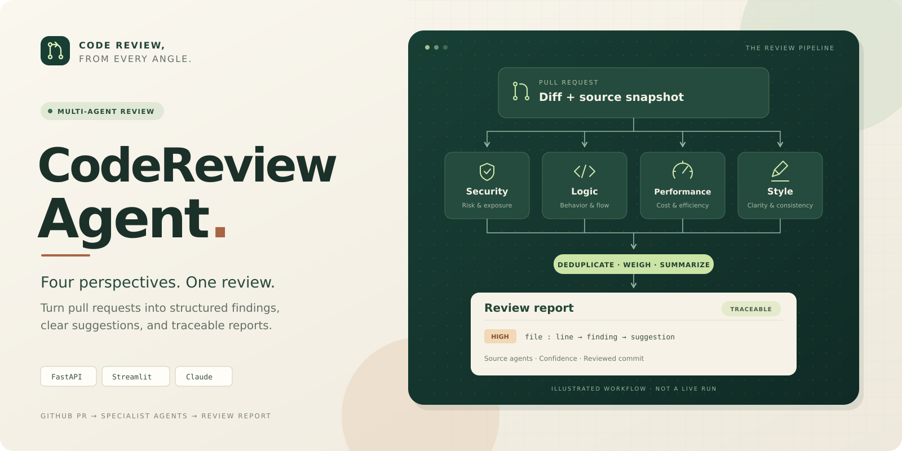

# 仓库视觉素材

[返回项目首页](../../README.md)

## 封面



- **源文件：** [repository-cover.svg](repository-cover.svg)
- **PNG 预览：** [repository-cover.png](repository-cover.png)
- **尺寸：** 1600 × 800，比例 2:1。
- **设计：** 暖白底色、深绿流程板、浅绿色重点与少量陶土色，延续现有 Streamlit 工作台的配色。
- **内容：** Pull Request → Security / Logic / Performance / Style → 聚合报告。
- **方式：** 代码绘制的原创 SVG，无 AI 图片 API 调用；没有嵌入远程字体、脚本或第三方图片。

README 使用 SVG，以便在不同屏幕尺寸下保持清晰。PNG 是同一 SVG 的导出预览，便于在不支持 SVG 的场景中使用。图片是概念流程插画，不是审查结果或运行截图。

## 修改与导出

使用支持 SVG 的编辑器，或直接修改源文件中的文字、路径与颜色。导出前检查标题、卡片内文字和箭头位置；修改 SVG 后同步更新 PNG。

可选的本地导出工具为 `@resvg/resvg-js`。安装在独立临时目录即可，无需向 Python 应用引入依赖。示例（在仓库根目录执行）：

```bash
npm install --prefix /tmp/codereview-cover-render --no-audit --no-fund @resvg/resvg-js@2.6.2
node <<'JS'
const fs = require('fs');
const { Resvg } = require('/tmp/codereview-cover-render/node_modules/@resvg/resvg-js');
const source = fs.readFileSync('docs/assets/repository-cover.svg');
const image = new Resvg(source, { font: { defaultFontFamily: 'DejaVu Sans' } });
fs.writeFileSync('docs/assets/repository-cover.png', image.render().asPng());
JS
```

本图使用系统字体 `DejaVu Sans` 与 `DejaVu Sans Mono`。为获得一致的 PNG，请在导出机器上安装这两个字体；SVG 在浏览器中可退回 Arial / sans-serif。
